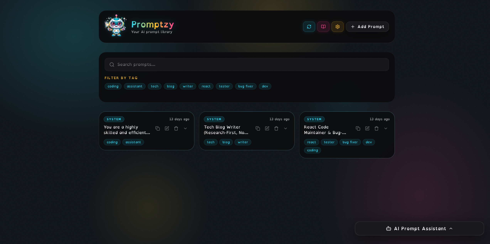

# ✨ Promptzy 🎯

<p align="center">
  
</p>

**Promptzy** - A web/desktop application for managing and organizing your AI prompts, with tagging, search, and cloud storage.

<div align="center">


</div>

> ### ⚠️ Upgrading from 1.x? Back up your prompts first
>
> Promptzy 2.0 is a security release that changes how prompt ownership works
> ([GHSA-x56f-9fqg-f568](https://github.com/pinkpixel-dev/promptzy/security/advisories/GHSA-x56f-9fqg-f568)).
>
> **After upgrading, the app will look empty.** Your prompts are still in your
> database, but they carry the old identifier and will not show up until you run
> one `UPDATE` statement. Nothing is deleted, but back up before you start:
>
> ```sql
> -- Run in your Supabase SQL Editor
> CREATE TABLE prompts_backup_1x AS SELECT * FROM prompts;
> ```
>
> Then follow **[DOCS/MIGRATION-2.0.md](DOCS/MIGRATION-2.0.md)**. It takes about
> five minutes.

## ✨ Features

- **Organize AI Prompts**: Store, edit, and categorize prompts for various AI models
- **Custom Tagging**: Organize prompts with custom tags for easy retrieval
- **Powerful Search**: Find the perfect prompt with full-text search and tag filtering
- **Cloud Storage**: Reliable Supabase cloud storage with cross-device sync
- **Backup & Restore**: Export your whole prompt library to JSON in one click, and import it back whenever you need it
- **Refresh Prompts**: Manual refresh button to sync prompts after configuration changes
- **AI Assistant**: Generate new prompts with AI — powered by [Pollinations](https://pollinations.ai), with selectable model and streaming responses
- **Progressive Web App (PWA)**: Install as a mobile app directly from your browser
- **Desktop App**: Native Electron app for Linux (more platforms coming)
- **Docker**: Run anywhere with a single `docker compose up` command
- **Documentation**: Full docs site at [promptzy-docs.pinkpixel.dev](https://promptzy-docs.pinkpixel.dev)
- **Modern UI**: Clean, responsive interface built with Shadcn/UI and Tailwind

## 🖥️ Screenshots

<p align="center">
  
</p>

## 🛠️ Installation

### Quick Start (Global Installation)

Install globally from npm and run with a single command:

```bash
# Install globally
npm install -g @pinkpixel/promptzy

# Run Promptzy
promptzy
```

Promptzy will start on `http://localhost:4173` and open automatically in your browser!

**Alternative commands:**

```bash
# Legacy commands still work
prompt-dashboard
ai-prompt-dashboard

# Or run directly with npx (no installation needed)
npx @pinkpixel/promptzy
```

### Local Development

```bash
# Clone the repository
git clone https://github.com/pinkpixel-dev/promptzy.git

# Navigate to the project directory
cd promptzy

# Install dependencies (choose one)
npm install
# or
bun install
# or
yarn install

# Start the development server
npm run dev
# or
bun run dev
# or
yarn dev
```

### 📱 Mobile App Installation (PWA)

Promptzy can be installed as a mobile app directly from your browser! No app store needed.

**On Mobile (iOS/Android):**

1. Visit the Promptzy website in your mobile browser
2. Look for "Add to Home Screen" or "Install App" popup
3. Tap "Install" or "Add"
4. Promptzy will appear on your home screen like a native app!

**On Desktop (Chrome/Edge):**

1. Visit the website
2. Look for the install icon in the address bar
3. Click to install as a desktop app

**Benefits of the Mobile App:**

- 📱 Native app experience with no browser UI
- ⚡ Faster loading and offline functionality
- 🔄 Automatic updates when new versions are released
- 🏠 Easy access from your home screen
- 🔄 Manual refresh button for syncing prompts after setup

### 🖥️ Linux Desktop App (Electron)

Download the native desktop app for Linux — no browser required.

Download the latest `.deb` or `.AppImage` from the [Promptzy GitHub Releases page](https://github.com/pinkpixel-dev/promptzy/releases).

**Install the `.deb` package:**

```bash
sudo dpkg -i Promptzy-*-amd64.deb
```

**Run the `.AppImage` (no install needed):**

```bash
chmod +x Promptzy-*-x86_64.AppImage
./Promptzy-*-x86_64.AppImage
```

### 🐳 Docker

Run Promptzy as a self-hosted web app in a Docker container.

**Quick start (pre-built image from source):**

```bash
git clone https://github.com/pinkpixel-dev/promptzy.git
cd promptzy
docker compose up --build
```

Promptzy will be available at `http://localhost:3000`.

**With Supabase & Pollinations credentials baked in:**

```bash
VITE_SUPABASE_URL=https://xxxx.supabase.co \
VITE_SUPABASE_ANON_KEY=your_anon_key \
VITE_POLLINATIONS_API_KEY=pk_your_key \
docker compose up --build
```

**Or build & run manually:**

```bash
npm run docker:build   # docker build -t promptzy .
npm run docker:run     # docker run --rm -p 3000:80 promptzy
```

> Credentials can also be configured at runtime through the in-app Settings dialog — no rebuild needed. Anything entered in Settings takes precedence over the values baked in at build time.

### Deployment

For deploying to Cloudflare Pages or other platforms, see the [DEPLOYMENT.md](DEPLOYMENT.md) guide.

## 🔧 Configuration

### Supabase Configuration

Promptzy stores your prompts in your own Supabase project. There is no built-in
database, and no shared one to fall back on. Supabase's free tier is plenty for
this, and setup takes a few minutes.

> **Upgrading from 1.x?** Read [DOCS/MIGRATION-2.0.md](DOCS/MIGRATION-2.0.md)
> first. 2.0 changes how prompt ownership works, and your existing prompts need
> one SQL statement to come across.

1. **Create a Supabase project** at [supabase.com](https://supabase.com). On your
   project page, click "Connect" and open the second tab to find your Project URL
   and anon key. They are also under Project Settings → API.

2. **Enter your credentials in Promptzy.** Open Settings (gear icon), paste the
   Project URL and API Key, and click "Connect".

3. **Run the setup script.** Click "Open SQL Editor" in Settings, then copy the
   script shown there (it is the same as [`supabase-setup.sql`](supabase-setup.sql))
   and run it. This creates the table and, importantly, the Row Level Security
   policies that scope every prompt to its owner.

   Supabase does not allow apps to create tables for you, so this step is manual.
   You only do it once per project.

4. **Turn off email confirmation** (optional). Under Authentication → Sign In /
   Providers → Email, switch off "Confirm email". Supabase's built-in email
   sender is rate limited and intended for testing, so leaving confirmation on
   means setting up your own SMTP before you can create an account. For a
   personal install, off is simpler.

5. **Create your account.** Back in Promptzy, sign up with an email and password.
   Your prompts are owned by this account.

### Using Promptzy on your phone

Point the second device at the same Supabase project and sign in with the same
account. Your prompts follow your account, so your phone and your laptop stay in
step. That is all there is to it.

### Backing up your prompts

**Settings → Backup & Restore → Export prompts** downloads your whole library as
a JSON file. **Import prompts** reads it back.

Import also accepts raw table rows exported from the Supabase SQL editor
(`SELECT json_agg(row_to_json(prompts)) FROM prompts;`), so a backup taken either
way can be restored. A prompt whose id matches one you already have replaces it,
so re-importing the same file gives you the same library rather than duplicates.

### How your prompts are protected

Every prompt row is owned by your Supabase Auth user id. The database enforces
that with Row Level Security policies that check `auth.uid()` on reads, inserts,
updates, and deletes, and the `anon` role is granted nothing on the table. The
app's own query filters are convenience, not the security boundary, so a leaked
anon key does not expose your prompts.

## 📖 Usage

1. Launch the application
2. Configure your Supabase connection in Settings, then run the setup script
3. Create your account and sign in
4. Add prompts with the "+" button
5. Assign tags to organize your prompts
6. Use the search box and tag filters to find prompts
7. Select a prompt to copy it or edit its details

## 🤖 AI Assistant

The AI Assistant panel sits at the bottom-right of the screen and lets you generate ready-to-use prompts with a single click.

### Setup

1. Grab a free API key from [enter.pollinations.ai](https://enter.pollinations.ai) — a publishable `pk_` key works fine for browser use
2. Open **Settings** (gear icon) → **AI Assistant Configuration**
3. Paste your key into **Pollinations API Key**
4. Optionally change the **AI Model** (default: `gemini-fast`)
5. Click **Save Changes**

### Generating a Prompt

1. Click **AI Prompt Assistant** in the bottom-right corner to expand it
2. Choose the prompt type: **System**, **Task**, **Image**, or **Video**
3. Describe what you want in the text area (e.g. _"a friendly customer support assistant"_ for a System prompt)
4. Click **Generate Prompt** — response streams in live
5. **Copy** the result to clipboard, or click **Use as Prompt** to save it directly to your library

### Available Models

Any [Pollinations text model](https://gen.pollinations.ai/api/docs) can be used. Some good picks:

| Model          | Description                                          |
| -------------- | ---------------------------------------------------- |
| `gemini-fast`  | Google Gemini 2.5 Flash Lite — default, fast & cheap |
| `openai`       | GPT-5 Mini — fast & balanced                         |
| `openai-large` | GPT-5.2 — most powerful                              |
| `claude`       | Claude Sonnet 4.6 — capable & balanced               |
| `deepseek`     | DeepSeek V3.2 — efficient reasoning                  |

### Customising the System Prompt

Open **Settings → AI Assistant Configuration**, uncheck **Use default system prompt**, and edit the prompt freely. Click **Reset to default** to restore the original at any time.

## 🧩 Tech Stack

- React 19 with TypeScript 5.8
- Vite 6 for fast builds + `@tailwindcss/vite` plugin
- **Tailwind CSS v4** (CSS-first architecture, no PostCSS config needed)
- Shadcn/UI components (Radix UI primitives)
- TanStack Query
- React Hook Form with Zod
- Supabase for cloud storage
- PWA (Progressive Web App) with Workbox (vite-plugin-pwa v1.2)
- **Electron 34** — native desktop app (Linux `.deb` & `.AppImage`; Windows & macOS builds available)
- **Docker** — multi-stage Nginx image for self-hosted deployments
- Cloudflare Pages for hosted deployment

## 📋 Roadmap

- [ ] Prompt version history
- [ ] AI prompt templates
- [ ] Shared prompt libraries
- [ ] Additional storage backends
- [ ] Advanced tagging with hierarchies

## 🤝 Contributing

Contributions are welcome! See the [CONTRIBUTING.md](CONTRIBUTING.md) file for details.

## 📜 License

This project is licensed under the MIT License - see the [LICENSE](LICENSE) file for details.

## 🙏 Acknowledgments

- [Shadcn/UI](https://ui.shadcn.com/) for the beautiful UI components
- [Tailwind CSS](https://tailwindcss.com/) for styling
- [Supabase](https://supabase.com/) for authentication and cloud storage

---

Made with ❤️ by [Pink Pixel](https://pinkpixel.dev)
